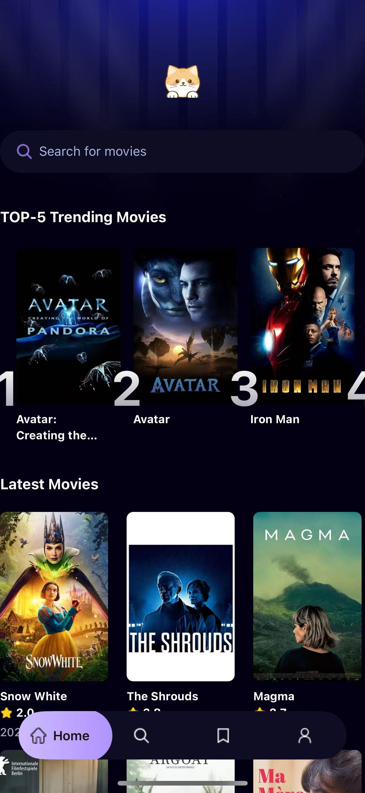

# The Movie App

## Introduction

The Movie App is a modern movie information application that provides users with rich movie content and personalized services. This project uses the latest technology stack to create a smooth user experience and efficient development process.

## Demo

[](https://haonantao.github.io/The_Movie_App/Demo.mp4)


## Technology Stack

### Frontend

- **React Native** - JavaScript framework for building cross-platform native applications
- **Expo** - Tools and services platform that simplifies React Native development
- **NativeWind** - Mobile styling solution based on Tailwind CSS, providing intuitive styling development experience

### Backend Services

- **Appwrite** - Open-source Backend-as-a-Service (BaaS) platform providing user authentication, data storage, and other services
- **TMDB API** - Provides rich movie data services

### Development Tools

- **TypeScript** - Adds static type checking to JavaScript
- **Custom Hooks** - For state management and business logic reuse
- **Tailwind CSS** - Utility-first CSS framework for building modern UIs

## Core Features

### Movie Browsing & Search

- Popular movies showcase
- Detailed movie information
- Smart search recommendations
- Category browsing

### Personalization

- User favorites management
- Watch history
- Personalized recommendations
- User rating system

### User System

- Account registration and login
- Profile management
- Preference settings

## Development Setup

### System Requirements

- Node.js 16.0 or higher
- npm 7.0+ or yarn 1.22+
- iOS 13.0+ / Android 6.0+

### Local Development

1. Clone the project:

```bash
git clone https://github.com/HAONANTAO/The_Movie_App.git
cd The_Movie_App
```

2. Install dependencies:

```bash
yarn install
# or using npm
npm install
```

3. Configure environment variables:
   Create a `.env` file and set the following variables:

```env
TMDB_API_KEY=your_tmdb_api_key
APPWRITE_ENDPOINT=your_appwrite_endpoint
APPWRITE_PROJECT_ID=your_project_id
```

4. Start the development server:

```bash
npx expo start
```

## Testing Guide

### Local Testing

1. Install Expo Go app:

   - iOS: [App Store](https://apps.apple.com/app/expo-go/id982107779)
   - Android: [Google Play](https://play.google.com/store/apps/details?id=host.exp.exponent)

2. After starting the development server, scan the QR code displayed in the terminal with your phone

3. Run command:

```bash
npx expo start
```

### Fork Testing Process

1. Fork this project on GitHub

2. Clone your forked repository:

```bash
git clone https://github.com/HAONANTAO/The_Movie_App.git
```

3. Set up upstream repository:

```bash
git remote add upstream https://github.com/original-owner/The_Movie_App.git
```

4. Create a new feature branch:

```bash
git checkout -b feature/your-feature-name
```

5. Commit your changes:

```bash
git add .
git commit -m "feat: add new feature"
git push origin feature/your-feature-name
```

6. Create a Pull Request on GitHub

## Project Structure

```
├── app/                  # Main application routes and pages
│   ├── (tabs)/          # Bottom tab pages
│   ├── movies/          # Movie-related pages
│   └── _layout.tsx      # Root layout component
├── assets/              # Static assets
│   ├── fonts/          # Font files
│   ├── icons/          # Icon resources
│   └── images/         # Image resources
├── components/          # Reusable components
│   ├── MovieCard.tsx   # Movie card component
│   ├── SearchBar.tsx   # Search bar component
│   └── TrendingCard.tsx # Trending movie card
├── constants/           # Configuration constants
├── interfaces/          # TypeScript interface definitions
├── services/            # API services
│   ├── api.ts          # API calls
│   ├── appwrite.ts     # Appwrite configuration
│   └── useFetch.ts     # Data fetching Hook
└── types/              # Type definitions
```

## Contribution Guidelines

We welcome all forms of contributions, including but not limited to:

- New feature proposals
- Bug fixes
- Documentation improvements
- Performance optimizations

### Contribution Process

1. Create a new issue describing the problem or feature you want to address
2. Fork the project and create your feature branch
3. Write code and tests
4. Ensure code meets project standards and passes all tests
5. Submit a Pull Request

### Code Standards

- Follow TypeScript best practices
- Use ESLint for code checking
- Write clear commit messages following Conventional Commits specification
- Keep code simple and add necessary comments

## Versioning

This project follows [Semantic Versioning](https://semver.org/) - format: MAJOR.MINOR.PATCH

## License

This project is licensed under the MIT License - see the [LICENSE](LICENSE) file for details

## Contact Us

For any questions or suggestions, please reach out through:

- Submit an Issue
- Send a Pull Request
- Project Discussion Board
